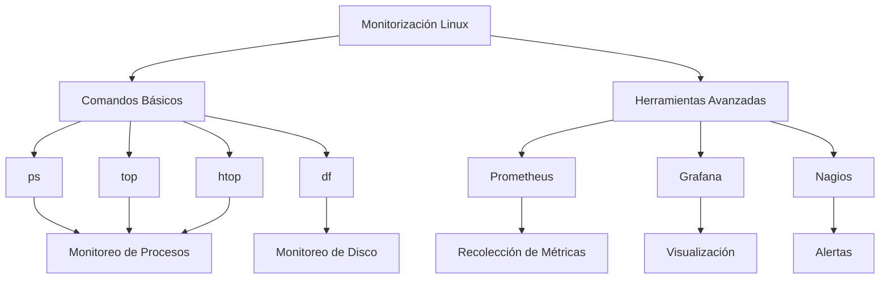

# 4. Mapa Conceptual de Monitorización 🗺️

## Diagrama de Flujo

## Relaciones entre Herramientas

1. **Comandos Básicos**: Monitoreo inicial
2. **Herramientas Avanzadas**: Análisis profundo
3. **Integración**: Complemento entre sistemas

[Volver al Índice](/README.md)
